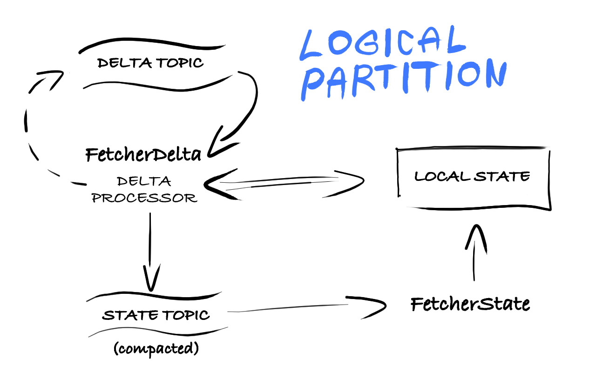

# Donut
### Recursive Stream Processing Framework

- **Author**: © Michal Harish (michal.harish AT gmail.com) 
- **License**: [GNU LGPL-3.0](LICENSE) 

This is a stream processing *playground* which shares many concepts and ideas with [Apache Samza](http://samza.apache.org/), but this prototype has been developed with recurisve usecase which we found difficult to implement with Samza.

- logical partitionining and stream cogroup
- Kafka log compaction topics for fault-tolerant state management
- Framework provides custom Kafka consumer group implementation deployed in YARN

1. [Desgin](#design)
2. [Example](#example)
3. [Configuration](#configuration) 	
4. [Development](#development)

<a name="design">
##Design 
</a>

**TODO Donut Application Architecture ... Pipeline, Component, Processing Unit, Logical Partition**

- Local State is purely in memory without replication and relies by design on state bootstrap from compacted topic. (The idea is to have hot regions of the local state to be accessible in constant time as normal concurrent hash map and have the cold regions sorted and  compressed lz4 with bloom filter index and have the oldest lz4 blocks evicted)
- It is fixed to at-least-once guarantee requiring fully idempotent application design
- It is more focused on iterative graph processing algorithms and the starting point for it was the [Connected Components](https://en.wikipedia.org/wiki/Connected_component_(graph_theory)) algorithm, more specifically it's [BSP](https://en.wikipedia.org/wiki/Bulk_synchronous_parallel) equivalent.. this prototype is under net.imagini.dxp.

<a name="example">
## Example 
</a>

The fundamental use case we are trying to implement here is a streaming equivalent of BSP Graph Connected Components which is recursive by nature.
This example application lives in a separate repository [GraphStream](https://github.com/michal-harish/graphstream)

<a name="configuration">
## Configuration
</a>

Each component of a pipeline has to be configured by at least the following parameters. Some of these will typically be shared across multiple components of the pipeline which can be loaded from the environment and some will be decisions made by the component implementation, e.g. kafka.brokers will be most likely same for all components but only long-running streaming components will need restart.containers=true,...

paramter                        | default       | description
--------------------------------|---------------|------------------------------------------------------------------------------
**group.id**                    | -             | Consumer group for the total set of all kafka partitions
**topics**                      | -             | Coma-separated list of kafka topics to subscribe to
**cogroup**                     | false         | If set to `false` the number of logical partitions is defined by the topic with the highest number of partitions. If set to `true` the number of logical partitions will be the Highest Common Factor of the number of partitions in each subscribed topic.  
**max.tasks**                   | -             | If set, maximum number of logical partitions - applies also in cogrouped mode 
**direct.memory.mb**            | 0             | TOTAL DIRECT MEMORY required from YARN cluster to be split between tasks - number of tasks depends on topics partitioning and cogroup and max.tasks arguments
**task.overhead.memory.mb**     | 256           | Extra heap memory for each task
**task.priority**               | 0             | Memory to allocate for each processing unit in YARN context [0-10]
**kafka.brokers**               | -             | Coma-separated list of kafka broker addresses 
*yarn1.restart.enabled*         | `false`       | If set to `true` any failed container will be automatically restarted.
*yarn1.restart.failed.retries*  | 5             | If restart.enabled is `true` any container that completes with non-zero exit status more than `failed.retries` time will cause the entire application to fail
*yarn1.jvm.args*                | -             | Extra JVM arguments besides the main memory which is managed under the hood as calculated from direct+heap memory as given in each container request
*yarn1.site*                    | `/etc/hadoop` | Local path where the application is launched pointing to yarn (and hdfs-hadoop configuration) files. This path should contain at least these files: `yarn-site.xml`, `hdfs-site.xml`, `core-site.xml`
*yarn1.queue*                   | -             | YARN scheduling queue name
yarn1...                        | ...           | For more Yarn1 optional configurations see [Yarn1 Configuration](https://github.com/michal-harish/yarn1#configuration)

<a name="development">
## Development
</a>

The project contains one submodule so after cloning you need to run: `git submodule update --init`

### TODOs

- WebUI: Add failed containers information to each logical partition, first as a number of times it failed with links to the list of failed container ids and host
- **Expose Local Storage as Key-Value API** and try mapping a Spark RDD onto it - this requires some basic Application Master UI
- The consumer group currently doesn't implement any rebalance algorithm so either check if the appName is already running on cluster or implement rebalance 
- Bootstrap fetcher could be stopped after it is caught up provided the delta fetcher updates the local state but this requires the DeltaFetcher to move the state topic offset as well which itself requires a custom producer implementation - the Kafka Producer API returns message offset but is not exposed with default Producer. It could be done using producer callback.handler but the problematic part is that the state and delta topics may not have same number of partitions. 
