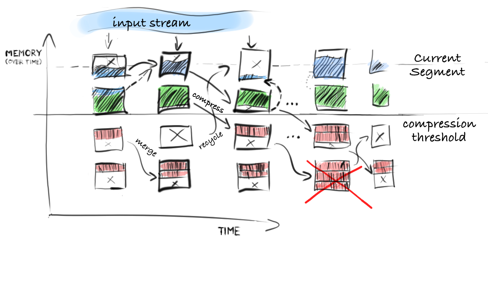

##ConcurrentLogHashMap

This is a specialised Thread-Safe HashMap based on in-memory block storage which may be partially compressed if a given minimum block size and load fraction conditions are met. 

It has a hash table index and a list of segments. Both of these internal structures are implemented in this package and are based on direct memory buffers which allows for zero-copy access although application must take some extra steps to ensure zero-copy. Direct memory buffers also allow for precise and cheap statistics about it's capacity, load factor and actual compression rate.

Each segments is a single pre-allocated block of memory which shrinks over time as the entries are popped to the top segment every time they are accessed. This leads to segments slowly evaporating except for the top one. Every attempt to allocate a new block of memory is tracked and triggers compaction under several conditions.

First, if the compaction factor of the current block is large enough, that is by compacting the current segment we will free significant amount of memory, the current segment is compacted. If the current segment is already compact enough and the new block doesn't fit within it, request for new segment allocation is made which can further trigger compression and segment recycling if the total memory usage of the hash map is larger than the maximum capacity given in the constructor.

The compression is triggered for a fractoin of tail segments, the current segment and other recent ones are never compressed. If the values that have been compressed are accessed again, the blocks containing them are uncompressed into the latest segment where they travel normally in the history of the log until they meet compressioncriteria again.

 
 
 

### References

- [Memory Barriers](http://mechanical-sympathy.blogspot.sk/2011/07/memory-barriersfences.html)
- [java.util.concurrent.atomic.AtomicReferenceArray](https://docs.oracle.com/javase/7/docs/api/java/util/concurrent/atomic/AtomicReferenceArray.html)
- [java.util.ConcurrentHashMap implementation](http://www.burnison.ca/articles/the-concurrency-of-concurrenthashmap)